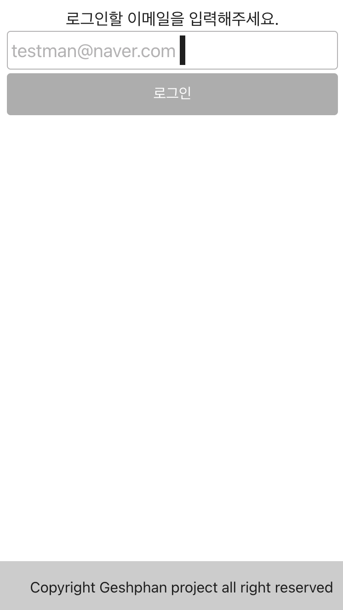
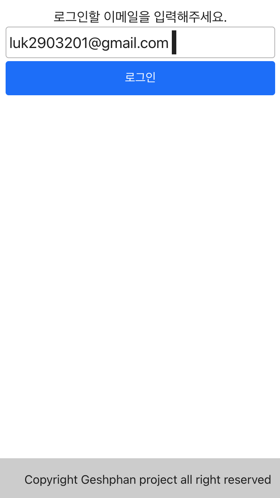
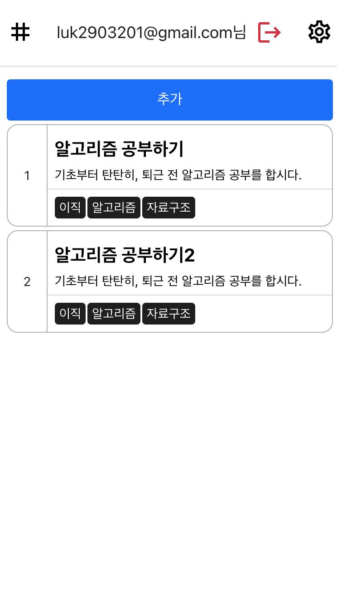

# atomic design practice

-   atomic design 방법론을 적용한 TODO리스트 프론트엔드 개발환경 구성
-   메인 화면 : https://yoonheecheol.github.io/ts_atomic_prj/
-   스토리북 화면 : https://yoonheecheol.github.io/ts_atomic_prj/storybook

### 기술스택


### 환경

-   node version >= 16.0.0v (18v 사용권장, 배포 시 18v 사용)

### 설치

```bash
yarn
```

### 실행

```bash
yarn start
```

### storybook

-   master 브랜치 push 될 경우 자동 배포

### 배포

-   master 브랜치 push 될 경우 자동 배포
-   Make pull request (dev > master)

### 화면

| 로그인 화면                          | 로그인(검증) 화면                    | TODO 입력화면                        |
| ------------------------------------ | ------------------------------------ | ------------------------------------ |
|  |  |  |
